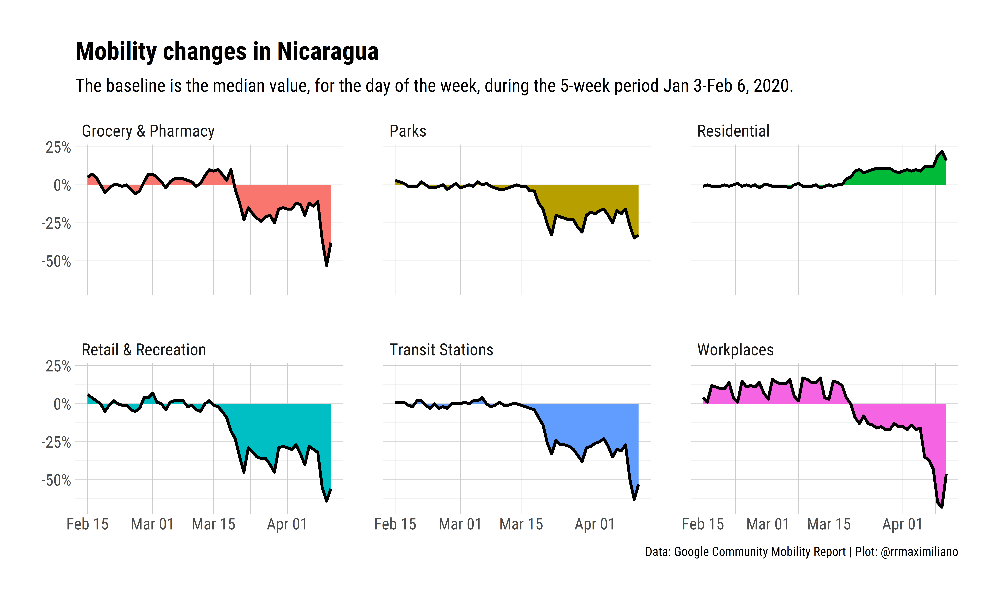

# Covid-19 Mobility Tracker: Nicaragua

This repository contains data from the [COVID-19 Mobility Report](https://www.google.com/covid19/mobility/) from Google for Nicaragua. I take the dataset from the repository [`pastelsky/covid-19-mobility-tracker`](https://github.com/pastelsky/covid-19-mobility-tracker) that uses reverse-engineer from the PDFs to create the CSV files.

## Folders structure

* `data`: contains the csv and rds files with data only for Nicaragua. 
* `scripts`: contains R scripts that were used to create and clean the dataset, and plot the figures below.
* `outputs\figures`: contains the outputs from the R scripts.  

## UPDATE :triangular_flag_on_post:

Before, I created a script that scrape the data from different repositories and set up a tidy dataset for countries in Central America. Turns out that the updated version of the [`covdata`](https://kjhealy.github.io/covdata/index.html) package now also includes the Google Mobility Report dataset which makes it easier to plot the figures that I created before. Therefore, you can find a new script, `3_covdata` that uses the package mentioned above to plot the figures below.

## Figures

```r
google_mobility %>% 
    filter(country_region_code == "NI") %>% 
    mutate(type = case_when(type == "retail" ~ "retail & recreation",
                            type == "grocery" ~ "grocery & pharmacy",
                            type == "transit" ~ "transit stations",
                            TRUE ~ type),
           type = str_to_title(type)) %>% 
    ggplot(aes(x = date, y = pct_diff, fill = type)) + 
    geom_ribbon(aes(ymin = 0, ymax = pct_diff)) + 
    geom_line(size = 1) +
    facet_wrap(~type) + 
    scale_y_continuous(labels = function(x) paste0(x, "%")) + 
    labs(x = NULL,
         y = NULL,
         color = NULL, 
         subtitle = "The baseline is the median value, for the day of the week, during the 5-week period Jan 3-Feb 6, 2020.",
         title = "Mobility changes in Nicaragua",
         caption = "Data: Google Community Mobility Report | Plot: @rrmaximiliano") + 
    theme_ipsum_rc() + 
    theme(
        legend.position = ""
    )
```




## Credits

All data made available for use is by taken from Google Mobility Reports. The reverse-engineer tools were constructed by Shubham Kanodia. I do not claim ownership over the data hosted in this repository. For information related to the `covdata` package please refer to the official [vignette](https://kjhealy.github.io/covdata/index.html).