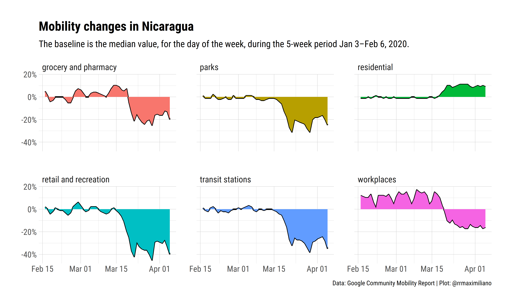

# Covid-19 Mobility Tracker: Nicaragua

This repository contains data from the [COVID-19 Mobility Report](https://www.google.com/covid19/mobility/) from Google for Nicaragua. I take the dataset from the repository [`pastelsky/covid-19-mobility-tracker`](https://github.com/pastelsky/covid-19-mobility-tracker) that uses reverse-engineer from the PDFs to create the CSV files.

## Folders structure

* `data`: contains the csv and rds files with data only for Nicaragua. 
* `scripts`: contains R scripts that were used to create and clean the dataset, and plot the figure below.
* `outputs`: contains the outputs from the R scripts.  

## Credits

All data made available for use is by taken from Google Mobility Reports. The reverse-engineer tools were constructed by Shubham Kanodia. I do not claim ownership over the data hosted in this repository.